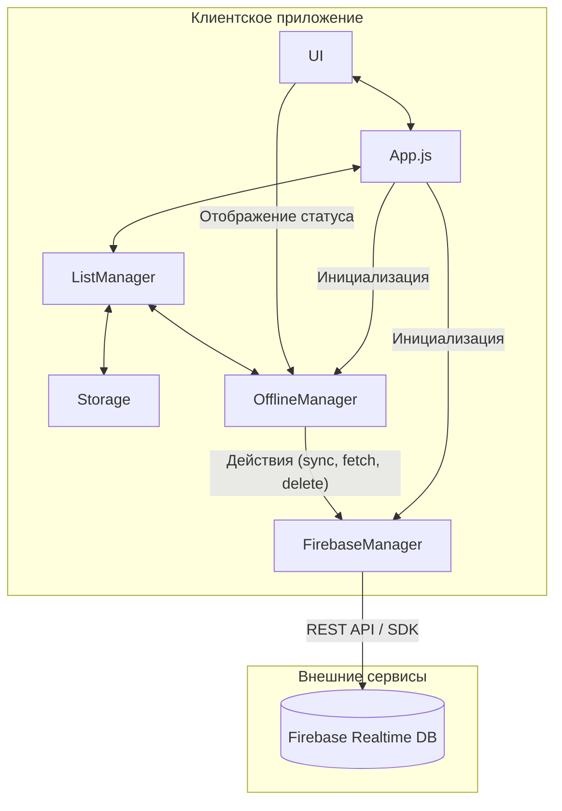

# Roadmap: Интеграция Firebase для облачных списков

Этот документ описывает план по интеграции Firebase Realtime Database в приложение для реализации функционала облачных списков.

## 🏗️ Архитектура

Новая архитектура будет включать два основных модуля: `FirebaseManager` для прямой работы с API Firebase и `OfflineManager` для управления состоянием сети и очередей синхронизации. `ListManager` и `Storage` будут обновлены для поддержки нового типа списков — `cloud`.



---

## 📋 План работ

### Этап 1: Настройка и инициализация Firebase

1.  **Создать файл `js/modules/firebase.js`:**
    - Этот модуль будет отвечать исключительно за инициализацию Firebase.
    - Он будет содержать функцию `initFirebase()`, которая считывает конфигурацию из переменных окружения.
    - Конфигурация будет браться из `import.meta.env.VITE_FIREBASE_CONFIG` (для Vite) или `process.env` (для других сборщиков). Это обеспечит корректную работу с переменными окружения Netlify.
    - Функция вернет инстансы `app` и `database`.
2.  **Обновить `index.html`:**
    - Подключить Firebase SDK через CDN для быстрой разработки. В дальнейшем можно будет перейти на npm-пакет.
    - ```html
      <!-- Перед вашим основным скриптом app.js -->
      <script type="module">
        // Загрузка переменных окружения для Netlify
        if (window.netlify) {
          window.process = {
            env: {
              ...window.netlify.env,
            },
          };
        }
      </script>
      <script src="https://www.gstatic.com/firebasejs/9.22.1/firebase-app-compat.js"></script>
      <script src="https://www.gstatic.com/firebasejs/9.22.1/firebase-database-compat.js"></script>
      ```
3.  **Обновить `app.js`:**
    - Вызвать `initFirebase()` в самом начале для инициализации соединения.

### Этап 2: Создание модуля `FirebaseManager`

1.  **Создать файл `js/modules/firebase-manager.js`:**
    - Создать класс `FirebaseManager`.
    - Конструктор будет принимать инстанс `database` из `firebase.js`.
    - **Методы:**
      - `constructor(database)`: Сохраняет инстанс БД.
      - `isOnline()`: Проверяет статус подключения к Firebase (`.info/connected`).
      - `syncList(listId, content)`: Записывает или обновляет данные списка по пути `/lists/main/lists/{listId}`.
      - `fetchList(listId)`: Получает данные списка из облака.
      - `deleteCloudList(listId)`: Удаляет список из облака.
      - `getRef(listId)`: Вспомогательный метод для получения ссылки на путь в БД.

### Этап 3: Создание модуля `OfflineManager`

1.  **Создать файл `js/modules/offline-manager.js`:**
    - Создать класс `OfflineManager`.
    - **Отслеживание состояния сети:** Использовать нативные `window.addEventListener('online', ...)` и `window.addEventListener('offline', ...)`
    - **Методы:**
      - `constructor(firebaseManager)`: Принимает `FirebaseManager`.
      - `init()`: Устанавливает слушателей `online`/`offline`.
      - `checkConnection()`: Возвращает текущий статус сети.
      - `enableOfflineMode()`: Блокирует UI для облачных операций, показывает `Toast` уведомление.
      - `enableOnlineMode()`: Разблокирует UI, запускает синхронизацию отложенных действий.
      - `queueAction(action)`: Добавляет действие (например, `{ type: 'sync', listId: 'myList', content: [...] }`) в очередь в `localStorage`.

### Этап 4: Интеграция с `ListManager` и `Storage`

1.  **Обновить `js/modules/storage.js`:**
    - Добавить методы для работы с кэшем облачных списков:
      - `cacheCloudLists(lists)`
      - `loadCloudListsFromCache()`
    - Добавить методы для очереди синхронизации:
      - `getSyncQueue()`
      - `saveSyncQueue(queue)`
2.  **Обновить `js/modules/listManager.js`:**
    - При рендеринге списков проверять их тип (локальный или `cloud`).
    - Для облачных списков (`cloud`) блокировать кнопки редактирования, переименования и удаления, если `OfflineManager.checkConnection()` возвращает `false`.
    - Добавить визуальные индикаторы для облачных списков.

### Этап 5: Обновление UI

1.  **В `listManager.js`:**
    - Рядом с названием облачного списка добавить иконку "облака" ☁️.
    - Добавить индикатор статуса синхронизации (например, цвет иконки: серый - офлайн, желтый - синхронизация, зеленый - синхронизировано).
2.  **В `toast.js`:**
    - Использовать для уведомлений о смене статуса сети ("Нет подключения к интернету", "Соединение восстановлено").
3.  **В `index.html`:**
    - Добавить глобальный индикатор статуса сети где-нибудь в шапке или подвале.

### Этап 6: Деплой и конфигурация Netlify

1.  **Настроить переменные окружения в Netlify:**
    - Создать переменную `FIREBASE_CONFIG` и поместить в нее JSON-строку с конфигурацией Firebase.
2.  **Проверить `_headers`:**
    - Убедиться, что настройки кэширования не мешают работе Service Worker и обновлению приложения.
3.  **Тестирование:**
    - Проверить работу приложения в онлайн и офлайн режимах после деплоя.
    - Убедиться, что облачные списки корректно синхронизируются.

---

Этот план обеспечивает пошаговую реализацию с возможностью проверки каждого этапа.
